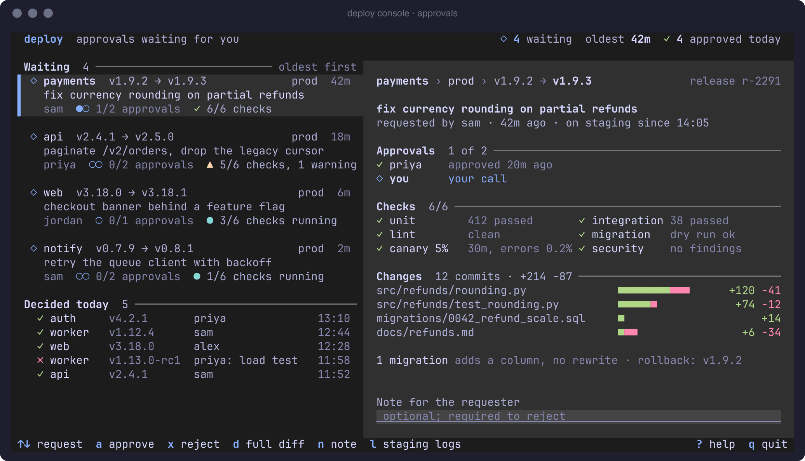
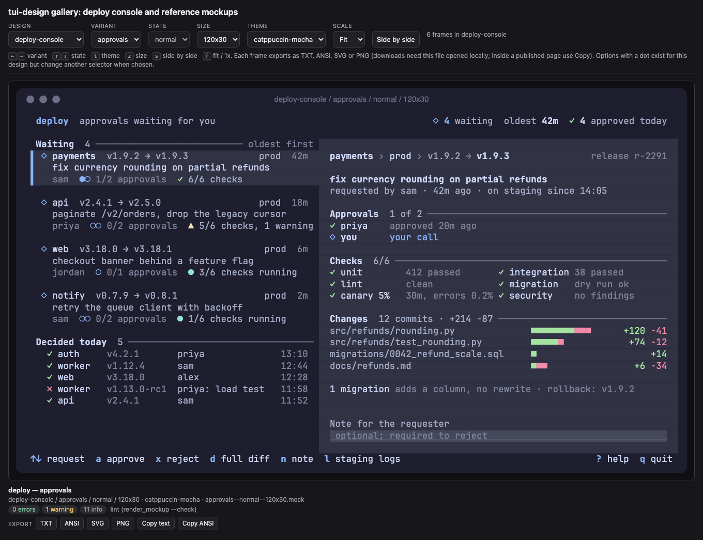
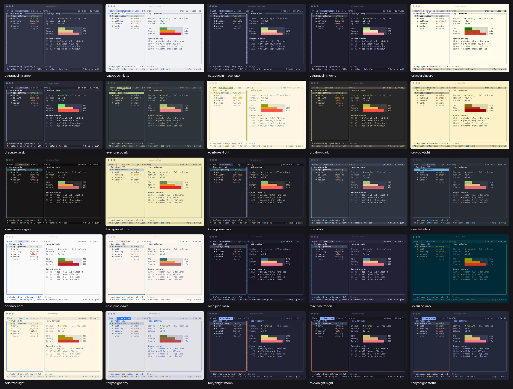

# tui-design

An agent skill that designs, mocks, builds and audits terminal UIs with evidence instead of taste:
full-screen apps, interactive CLIs and pickers, and plugin panels or popups inside a host (tmux, Neovim,
k9s, lazygit, …).

Every sketch is a `.mock` frame on the real cell grid — linted at a declared size and rendered to PNG
before anyone sees it. Not for web or native GUIs, terminal-emulator themes, editor themes, or shell prompts.



*Concept C of the [worked example](docs/showcase/deploy-console/README.md): a linted `.mock` at 120×30 and
256 colors, built with `mockkit.py` and scored on the visual-craft rubric.*

Every design comes back as a self-contained HTML gallery: each frame in every state, size and theme, with
keyboard navigation, side by side, and TXT / ANSI / SVG / PNG export. The reference frames are published at
<https://diegomarino.github.io/tui-design/>.



## What you get

| You ask for | You get |
| --- | --- |
| opinions on a TUI or screenshot | findings ordered by user harm, each with evidence and what it needs |
| a new screen or redesign | three concepts → linted frames × state × size → HTML gallery |
| code, a prototype, or a theme in a stack | a starter (Ink, Textual, Bubble Tea, Ratatui, gum) plus cell-level compare |
| a measured audit | live capture or screenshot → description → 135-check report |
| only colors | 44 tokens, contrast at truecolor and 16 colors, exporters |

## Try it

- "Sketch a log viewer for our job runner at 80×24 and at a 60-column split."
- "Review this screenshot of my TUI. What would you change first?"
- "Map Gruvbox onto my Textual app's theme and check contrast at 16 colors."

## Install

```bash
npx skills add diegomarino/tui-design                # into the current project
npx skills add diegomarino/tui-design -g             # for your user, all projects
npx skills add diegomarino/tui-design#v0.1.0         # pinned to a release
```

Or copy only `skills/tui-design/` into `.claude/skills/` or `.agents/skills/` (~2.1 MB of references,
scripts, themes and starters). Scripts need Python 3.11+; PNG rendering needs `rsvg-convert` (librsvg).
Full requirements and more prompts: [Getting started](docs/getting-started.md).

## What it does

- **Terminal-honest frames.** Every sketch is a `.mock` on the cell grid at a declared size, linted and
  rendered to PNG before review. [Mockups →](docs/features/mockups.md)
- **A gallery to judge it.** One HTML page per design, every frame in every chosen theme.
  [Gallery →](docs/features/gallery.md)
- **Host capability profiles.** A plugin's design starts from what the host can draw: a test card (attributes,
  16/256/24-bit color, glyph widths), a key probe, and a `#! caps:` line on every frame.
  [Host verification →](docs/features/host-verification.md)
- **Audits that separate perception from judgment.** A live capture or a screenshot pipeline (colors sampled
  from pixels, never guessed) produces a description, redraws it, diffs it against the source, then runs a
  135-check list. [Audit →](docs/features/audit.md)
- **Themes and contrast.** 25 variants of 10 schemes on 44 semantic tokens, contrast checked at truecolor and
  16 colors; exporters for Textual, Ink, Lip Gloss, Ratatui, gum and CSS.
  [Themes →](docs/features/themes.md)
- **Five framework starters.** Ink, Textual, Bubble Tea, Ratatui and gum render the same demo from a theme
  JSON, with a headless frame mode to compare a build with its mockup cell by cell.
  [Starters →](docs/features/starters.md)
- **Design guidance with sources.** Archetypes, keys and navigation, lifecycle (cleanup, suspend, editor
  handoff), the shell contract (exit codes, signals, pipes) and accessibility — drawn from k9s, lazygit,
  btop, yazi, helix and the frameworks' own docs.

<a href="docs/features/themes.md"></a>

## Evidence

A/B on 24 cases × 4 models (skill vs baseline, same prompt and fixtures): **+25 to +37 pass-rate points**,
at **2.5–4× cost per run** (one repetition). Roughly half the gain is the skill's checked artifacts; the rest
is behavior a baseline could have shown. What each run does, and the limits of that number:
[Evals](docs/evals.md).

## Documentation

| Doc | Covers |
| --- | --- |
| [Getting started](docs/getting-started.md) | install, first prompts, branches |
| [Concepts](docs/concepts.md) | frames, the cell grid, caps, perception vs judgment, tokens |
| [Showcase: deploy console](docs/showcase/deploy-console/README.md) | worked example, three concepts |
| Features | [mockups](docs/features/mockups.md) · [gallery](docs/features/gallery.md) · [host verification](docs/features/host-verification.md) · [audit](docs/features/audit.md) · [themes](docs/features/themes.md) · [starters](docs/features/starters.md) |
| [Evals](docs/evals.md) | what was measured, the published scores, how to repeat a run |
| [Architecture](docs/contributing/architecture.md) · [CHANGELOG](CHANGELOG.md) | scripts, tests, recipes for contributors |

## Repository layout

```
skills/tui-design/   the skill (the only folder `npx skills add` installs)
docs/                documentation, generated images, the worked example
evals/               behavior and trigger evals, results and ledger
tests/               unit tests for the skill's scripts, the eval harness and the gallery page
tools/               check_public.sh, check_links.py, make_screenshots.py
.github/workflows/   pages.yml publishes the reference gallery
```

## Contributing

See [CONTRIBUTING.md](CONTRIBUTING.md) and [docs/contributing/architecture.md](docs/contributing/architecture.md).
Every commit under `skills/tui-design/` reaches users on their next `npx skills update`, so changes there land
finished.

## Credits and license

Ideas adopted from [gfargo/tui-design-skill](https://github.com/gfargo/tui-design-skill), color values from each
scheme's upstream project, and the rest of the third-party material are listed in [CREDITS.md](CREDITS.md).

[MIT](LICENSE) © @diegomarino
