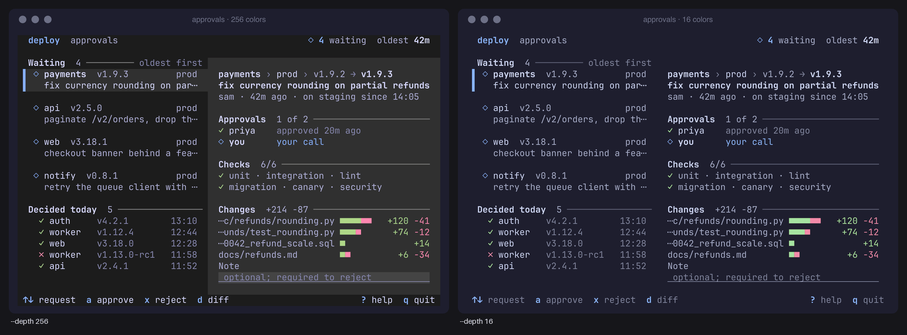

# Concepts

Five ideas run through the skill. They explain why the agent asks the questions it asks and why its output looks
the way it does.

## Terminal-honest frames

A terminal screen is a grid of cells: one font size, integer columns, a foreground and background color per cell,
a few attributes (bold, dim, italic, underline, inverse, strike) and box-drawing characters for structure. A design
that cannot be drawn in that grid, or that the host cannot draw, does not exist.

So every sketch the agent shows is a **frame**: a `.mock` file at a declared size (`#! size: 80x24`), linted by
`render_mockup.py --check` and rendered to PNG before anyone sees it. Hand-typed boxes in chat drift off the grid;
frames cannot. Each screen exists in its required states (normal, empty, error, busy…) and sizes (80×24, a wider
size, a 60-column split), with a "too small" message below its minimum. See [Mockups](features/mockups.md).

## The cell grid

Width is measured per code point: East Asian Wide and Fullwidth characters take 2 cells, combining marks 0, the
rest 1. Emoji and CJK glyphs shift every column after them, and some "text" symbols (`✔`, `⚠`) turn into 2-cell
color emoji in some terminals. The linter flags them and suggests a safe replacement (`✓`, `▲`). Status is always
a glyph and a color (`✓` success, `▲` warning, `✗` error), never color alone.

The same grid is what the audit tools read back: `capture_tui.sh` saves the cells a running app drew, and
`ansi_grid.py` turns them into JSON with exact text, colors and attributes.

## Capability profiles

A plugin inside a host (a tmux popup, a Neovim float, a k9s plugin) can only show what the host draws. The
**capability profile** records that, and every frame carries it:

```
#! caps: attrs=bold,dim,inverse colors=256 glyphs=unicode widgets=list,tabs source=test-card
```

| Key | Values | Checked by `--check` |
|---|---|---|
| `attrs` | subset of `bold dim italic underline inverse strike` | an attribute outside the list is an error |
| `colors` | `truecolor` `256` `16` `none` | the frame renders at that depth |
| `glyphs` | `ascii` `unicode` `nerd` | glyphs above the level are errors (with an ASCII fallback for `ascii`) |
| `widgets` | free list | informational |
| `source` | `test-card` `docs` `code` `assumed` | a warning unless `test-card` or `docs` |

`source=` says where the profile came from. What the current code uses is not evidence (a plugin drawing 8 curses
colors may run in a truecolor pane), so `code` and `assumed` keep a warning until someone runs the
[test card](features/host-verification.md) inside the host and sends a screenshot. A free-standing app in a modern
terminal can leave the line out; the defaults (all attributes, truecolor, unicode) apply.



*A frame at its caps depth and at 16 colors, where every background token falls back to the terminal default.
The skill's craft rubric asks for both renders.*

## Perception vs judgment

An audit keeps perception and judgment apart, with a proof in between:

1. **Perceive**: produce a `tui-description`, a JSON file listing the screen's regions, elements, text, colors and
   attributes, with no opinions in it. From a live capture this is measured exactly (`ansi_grid.py --describe`). From a
   screenshot, vision models describe layout and text in separate passes, and colors come from pixels
   (`sample_colors.py`), never from a model.
2. **Prove**: redraw the description as a frame (`description_to_mock.py`) and compare it cell by cell with the source
   (`compare.py`). A description that does not reproduce the screen is fixed before anyone judges it.
3. **Judge**: apply the 135-check list to the validated description, citing region and element ids as evidence.

This keeps a confident but wrong reading of a screenshot from turning into a confident but wrong report. See
[Audit](features/audit.md).

## Tokens, not colors

Nothing in a design names a hex value. Every color is one of 44 **semantic tokens** (`fg.muted`, `border.focus`,
`selection.bg`, `status.error`…) defined in [`_tokens.json`](../skills/tui-design/references/themes/_tokens.json);
a **theme** maps each token to a color of one scheme, with a 16-color fallback (`ansi16`) and a source for every
choice. `.mock` files reject hex outright.

That buys three things: one design renders in any of the [25 themes](features/themes.md); contrast is checked per
token pair (`fg.muted` on `bg.base`, `selection.fg` on `selection.bg`…) at truecolor and at 16 colors; and the
build gets its theme code generated (`export_theme.py --target textual|ink|lipgloss|ratatui|gum|css|json`), so no
color literal is typed by hand.
