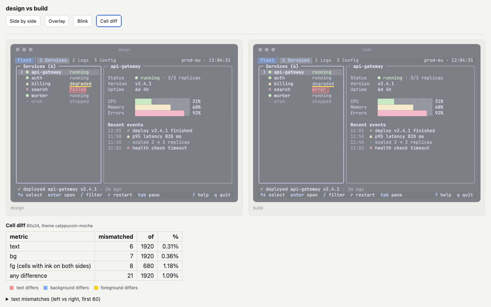

# Audit

An audit turns a screen into a neutral description, proves the description against the screen, and only then
judges it against a 135-check list ([why](../concepts.md#perception-vs-judgment)). There are two ways in: a live
capture when the app runs, and a screenshot pipeline when all you have is an image. The procedure the agent follows,
with every command, is the skill's [audit-protocol.md](../../skills/tui-design/references/audit-protocol.md).

## Live capture (the app runs)

```bash
S=skills/tui-design/scripts
$S/capture_tui.sh -s 120x30 -s 80x24 -s 60x18 -o audit/main/ -- /abs/path/to/app --flag
$S/capture_tui.sh -s 120x30 -k Tab -k j -o audit/second-pane/ -- /abs/path/to/app     # after some keys
$S/capture_tui.sh -s 80x24 -e NO_COLOR=1 -o audit/nocolor/ -- /abs/path/to/app        # another color profile
```

`capture_tui.sh` starts the app in a detached pane of a private tmux server (`tmux -L tui-capture-<pid>`, never
your own), waits until the screen settles, and writes per size `<cols>x<rows>.ansi` (the cells with their escapes),
`.txt` and `.meta.json` (command, environment, keys, cursor, alternate screen, stability). Later sizes resize the
same running app, which is what a responsive check needs; `-f` restarts it per size instead. For apps that redraw
continuously, `-p 3` samples for three seconds and marks the cells that change as volatile.

Then read the frame back as data:

```bash
python3 $S/ansi_grid.py audit/main/120x30.ansi --describe -o audit/main/120x30.skeleton.json   # description skeleton
python3 $S/ansi_grid.py audit/main/120x30.ansi --clutter                                       # clutter counts
```

`--describe` writes a `tui-description` skeleton with the exact text, palette, boxes (closed from box-drawing
corners, with titles and border labels), header and status bands and key hints from the last row. A describer
then only labels roles and states. `--clutter` counts chrome share, border nesting depth, markers repeated on every
row, duplicated status signals and blank share per region, each with a verdict:

```
| chrome share | 72.3 % (389 chrome / 149 content cells) | notable (> 50 %: drop rules/boxes, let alignment and spacing group) |
| border nesting depth | 3 (3 boxes) | notable (> 1: flatten, one border level per region) |
| duplicate status signals | 8 row(s) | notable (glyph + word is the baseline; keep one of tag/glyph, say the type once) |
```

Both work on `.mock` files too, so the agent runs `--clutter` on its own frames.

## Screenshot (image only)

| Step | Script | What it does |
|---|---|---|
| 1 | `prep_screenshot.py shot.png -o prep/` | finds the cell grid in the pixels (row and column pitch, origin), writes `grid.json`, a plain image, a ruler image and later per-region crops |
| 2 | `describe_prompt.py --pass 1 --grid prep/grid.json` | builds the exact prompt for a vision describer: layout and regions |
| 3 | vision subagents | pass 1 twice (layout), then pass 2 once per leaf region (text and elements) |
| 4 | `sample_colors.py shot.png --grid prep/grid.json --themes all` | per-cell background and foreground from pixels, matched to theme tokens; never from the model |
| 5 | `merge_description.py --pass1 … --pass2 … --cells … --grid …` | one validated `tui-description` |

The prompt text lives in the skill's [describe-tui.md](../../skills/tui-design/references/prompts/describe-tui.md);
`describe_prompt.py` fills it from the image facts and appends an output contract generated from the description
schema. `prep_screenshot.py` and `sample_colors.py` need Pillow and numpy, which `uv run` fetches for the run. When
the grid cannot be measured, `prep_screenshot.py` asks for the terminal size (`--cols C --rows R`).

## Prove the description

```bash
python3 $S/description_to_mock.py desc.json -o recon.mock                  # draws only what the description asserts
python3 $S/compare.py source.ansi recon.mock --labels source,description -o cmp.html
```

The reconstruction leaves everything the description does not claim blank, so omissions show up as differences.
`compare.py` puts two frames in one HTML page with side by side, overlay, blink and, when both are text grids
(`.ansi` or `.mock`), a cell diff: red boxes for text, blue fills for background, yellow bars for foreground, and a
table of counts. Images (`.png`, `.svg`) work too, without the cell diff. The agent iterates at most twice before
judging.



*The Fleet demo against a copy with one changed word, one changed color and one missing background: 21 differing
cells of 1920.*

The same page compares a mockup with a framework's captured frame during a build
([starters](starters.md#capture-and-compare)).

## Judge

The agent applies every check of the skill's
[audit-checklist.md](../../skills/tui-design/references/audit-checklist.md) to the validated description: each is
pass, fail with evidence (region and element ids) or not applicable with a reason. The report follows
[audit-report.md](../../skills/tui-design/references/templates/audit-report.md), with findings ordered by user harm.

For a quick opinion without the full procedure, ask for a review instead: the quick review uses a short core of the
checklist (§0 in [audit-quick.md](../../skills/tui-design/references/audit-quick.md)) plus the clutter count and an
80×24 / 60-column floor test.

`score_description.py` measures a description against ground truth (grid, regions, text error rate, colors, key
hints, neutral wording); the skill uses it to calibrate the screenshot path, and `--truth-from-mock` builds the
ground truth from a `.mock`.
