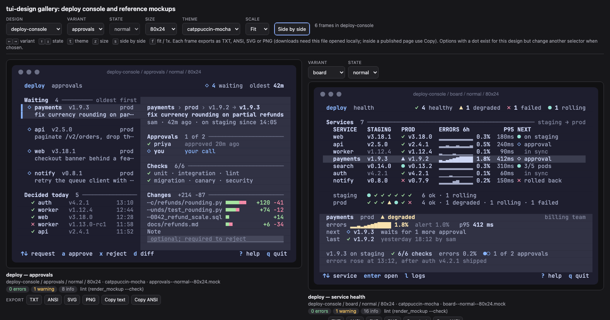

# Gallery

`gallery.py` turns directories of frames into one self-contained HTML page: every frame rendered in every chosen
theme, with selectors, keyboard navigation and export buttons. It is how the agent hands you a design to judge.


## Build one

```bash
python3 skills/tui-design/scripts/gallery.py design/ --themes catppuccin-mocha,gruvbox-dark -o gallery.html
python3 skills/tui-design/scripts/gallery.py design/ proto/ --themes all --title "Jobs, two designs" -o all.html
```

- **Input**: directories of `<variant>--<state>--<cols>x<rows>.mock` or `.ansi` files. Each directory with frames
  is one *design* (sub-directories are scanned too); a `.mock` wins over an `.ansi` with the same name, so a
  framework's captured frames sit next to the mockups.
- **Themes**: `--themes a,b,c` takes theme ids or theme JSON paths; `all` takes all 25. Without `--themes`, each
  `.mock` uses its own `#! theme:` line, else `catppuccin-mocha`.
- The page makes no external requests: SVG frames are inline, colors are stored once per theme, and N themes cost
  little more than one.

## Selectors and keys

| Control | Key |
|---|---|
| Variant (concept) | `←` `→` |
| State (normal, empty, error…) | `↑` `↓` |
| Theme | `t` (`T` or `shift+t` goes back) |
| Size | `z` |
| Side by side | `s` |
| Scale: fit to the window or 1x | `f` (the Scale selector also offers 1.5x and 2x) |

A selector value that exists in the design but not with your other choices is marked with a dot; choosing it snaps
the other selectors to the closest frame that exists, so every selection shows a real frame. Under each frame the
caption gives its title, source file and lint summary (the same linter as `render_mockup.py --check`).

## Side by side

`s` (or the **Side by side** button) shows two frames of the same design at the same size and theme. The right
pane has its own variant and state selectors: compare two concepts, or one concept in two states.



## Export

Each frame has **TXT**, **ANSI**, **SVG** and **PNG** buttons (the file is named
`<design>--<variant>--<state>--<size>--<theme>`), plus **Copy text** and **Copy ANSI**. ANSI files carry the
frame's escape sequences in the chosen theme, so `cat frame.ansi` shows it in a terminal.

For files in bulk, skip the browser:

```bash
python3 skills/tui-design/scripts/gallery.py design/ --themes catppuccin-mocha --export out/ --formats txt,png
# out/<design>/<variant>--<state>--<cols>x<rows>--<theme>.{txt,ansi,svg,png}   (PNG needs rsvg-convert)
```

## Viewing it

- **Locally**: open `gallery.html` in a browser. Downloads work from a local file in current browsers.
- **If the browser blocks file actions** (some block downloads or clipboard access on `file://` pages), serve the
  folder and open it over HTTP:

  ```bash
  cd path/to/folder && python3 -m http.server 8000      # then open http://localhost:8000/gallery.html
  ```

- **Sharing**: the file is self-contained, so you can send it, attach it to an issue or publish it as a static page.
  Agents that can publish pages (artifacts, previews) may offer to publish the gallery for you.
- **Reference gallery**: the demo and the reference mockups, in all 25 themes, are at
  <https://diegomarino.github.io/tui-design/>. [pages.yml](../../.github/workflows/pages.yml) rebuilds that page
  when the frames, the themes or the gallery renderer change. In the repository settings, Pages → Build and
  deployment → Source has to be **GitHub Actions**.
- **Sandboxed hosts**: inside a published artifact or another sandboxed frame, downloads are usually blocked. The
  page says so after a click ("if nothing downloaded, this page is sandboxed: use Copy"). Use the Copy buttons, or
  generate the files with `--export`.

The page's JavaScript (keys, side by side, real downloads rather than `blob:` navigations) is covered by
`tests/test_gallery_browser.py`, which runs when a Playwright with a browser is installed.
