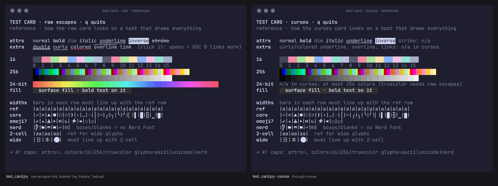

# Host verification

A plugin or popup runs inside a host (tmux, zellij, Neovim, k9s…) that decides what reaches the screen and which
keys reach the app. Three scripts measure that inside the real host, so the design starts from evidence instead
of from what the current code happens to use. The agent asks you to run them and send screenshots; it cannot see
your host itself.

## Test card: what the host can draw

```bash
python3 skills/tui-design/scripts/test_card.py            # raw escapes, like Ink, Bubble Tea, Ratatui, Textual
python3 skills/tui-design/scripts/test_card.py --curses   # through Python curses, like a curses plugin
```

Run it inside the host (in the popup, the pane, the float), take one screenshot, and compare it with the
reference the skill ships:



*References in [`assets/test-card/`](../../skills/tui-design/assets/test-card/): how each card looks on a host that
draws everything. Anything the reference shows and your screenshot lacks is something the host drops.*

| Row | Read it as |
|---|---|
| `attrs`, `extra` | a word that looks like `normal` is an attribute the host drops (italic and strike are the usual casualties) |
| `16` | the host's own palette: what 16-color tokens become |
| `256` | a smooth cube and grey ramp means 256 colors work |
| `24-bit` | a smooth sweep is truecolor; visible bands mean the host quantizes to 256 |
| `fill` | whether background fills survive |
| `widths` | every `\|` must line up with the `ref` row; a bar that drifts marks a glyph drawn two cells wide |
| `nerd` | boxes or blanks mean no Nerd Font |

The card also prints `TERM`, `COLORTERM` and the pane size. The two modes differ on purpose: curses has no strike,
no curly or colored underline, no links and at most 256 colors, so a curses plugin is measured with `--curses`. One
screenshot fills the whole `#! caps:` line, and the frames then say `source=test-card`
([capability profiles](../concepts.md#capability-profiles)). Piped (`> card.ansi`) or with `--print`, the card is
written once instead of waiting for a key, and `ansi_render.py` can render it.

## Key probe: which keys reach the app

```bash
python3 skills/tui-design/scripts/key_probe.py f2 ctrl+s alt+s shift+tab ctrl+right
```

The OS, the terminal and the host take some keys first: macOS turns F-keys into media keys unless `fn` is held, ⌘
shortcuts belong to the terminal, a host prefix belongs to the host. Run the probe inside the host with the keys
the design's footer shows, press each one, and send a screenshot. A key that never turns ✓ does not reach the app;
the design picks another. Without arguments it probes `f1 f2 f5 ctrl+s ctrl+r alt+s shift+tab ctrl+right home end`.
Press `ctrl+c` twice to quit.

## `play_mock.py`: draw the design in the host

```bash
python3 skills/tui-design/scripts/play_mock.py queue--normal--80x24.mock [--theme ID] [--depth auto|256|16]
python3 skills/tui-design/scripts/play_mock.py --probe        # same as test_card.py --curses
```

Before any code exists, this draws a chosen frame with curses inside the host, the way a curses app would: one
color pair per foreground/background pair, 256-color indexes when the terminal reports 256 colors, otherwise the
theme's 16-color mapping. A status line shows what the host reported (`TERM`, `COLORTERM`, curses colors and pairs,
size), so the screenshot is evidence. Keys: `d` toggles 256 ↔ 16 colors, `i` toggles the info line, `q` quits. A
frame larger than the pane shows a message instead.

## Order of use

1. Framing: test card (and key probe if the footer uses anything beyond letters and arrows).
2. Design: frames carry `#! caps: … source=test-card`; `render_mockup.py --check` enforces it.
3. Before building a plugin: `play_mock.py` on the chosen frame, one screenshot per depth.

Every tmux the scripts or the agent start uses a private socket (`tmux -L <name>`); your own tmux server is never
touched.
