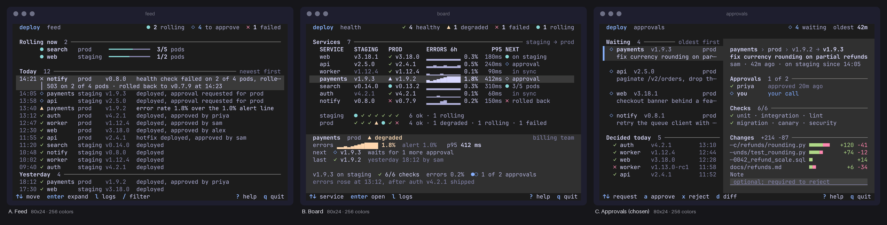

# Mockups

A mockup is a `.mock` file: one frame of a screen at a declared size, in a small markup of semantic tokens. The
agent builds frames with `mockkit.py`, lints them with `render_mockup.py --check` and renders them to PNG.



*The [worked example](../showcase/deploy-console/README.md): one job, three concepts, each a linted frame.*

## The `.mock` format

```
#! tui-mockup 1
#! size: 80x24
#! title: Fleet — list + detail demo
#! state: normal
#! caps: attrs=bold,dim,inverse colors=16 glyphs=unicode
#! region r2 list 0,1,32,21 Services (6)
{border.focus}╭─{/}{fg.title bold} Services (6) {/}{border.focus}───╮{/}
│ {accent.primary bold on:selection.bg}❯{/} …
```

- **Header** lines start with `#! `. Required: `tui-mockup 1` and `size: COLSxROWS`. Optional: `title:`, `state:`,
  `theme:`, `caps:` (the [capability profile](../concepts.md#capability-profiles)), `region <id> <role> x,y,w,h`,
  `focus`, `selected`, and any number of `note:` lines.
- **Body**: one line per terminal row, at most `cols` cells wide.
- **Tags**: `{spec}` opens a style and `{/}` closes it. A spec is one foreground token, `on:<token>` for the
  background, and attributes (`bold dim italic underline inverse strike`). Raw hex and unknown tokens are errors.
- **Names**: `<variant>--<state>--<cols>x<rows>.mock`, e.g. `queue--empty--80x24.mock`. The gallery groups frames by
  these names.

The full specification is in the skill's [formats.md](../../skills/tui-design/references/formats.md#mockup-format).

## Building frames with `mockkit.py`

Hand-written tags are fine for a few lines; beyond that the agent uses `mockkit.py`, a canvas that places text,
fills, boxes and widgets at cell coordinates and refuses anything that would break the grid (off-canvas writes, text
over a border, wide glyphs, unknown tokens, caps violations).

```python
import sys
sys.path.insert(0, "skills/tui-design/scripts")
from mockkit import Canvas, Col

c = Canvas(40, 8, title="Hello", state="normal", theme="catppuccin-mocha")
c.band(0, [("Hello", "accent.primary bold")], [("prod · 12:04", "statusbar.fg")], region="header")
body = c.rect.inset(0, 1, 0, 1)                      # rows 1..6: between header and footer
inner = c.panel(body, "Services (2)", role="list", focus=True)
c.table(inner, columns=[Col("", 1), Col("NAME"), Col("STATE", 8)], selected=0, cursor="❯",
        rows=[[("●", "status.success"), "api-gateway", "running"],
              [("▲", "status.warning"), "billing", ("degraded", "status.warning")]])
c.keybar(7, [("↑↓", "select"), ("enter", "open")], region="keybar")
c.save("hello--normal--40x8.mock")                   # lints with the same linter as --check
```

```
 Hello                     prod · 12:04
╭─ Services (2) ───────────────────────╮
│     NAME                    STATE    │
│ ❯ ● api-gateway             running  │
│   ▲ billing                 degraded │
│                                      │
╰──────────────────────────────────────╯
 ↑↓ select  enter open   ? help  q quit
```

`save()` prints one line, `mockkit: saved hello--normal--40x8.mock · 0 errors · 0 warnings → .`, plus one line per
warning; `matrix()` prints one line for the whole set (`saved 12 frames · 0 errors · 3 warnings → DIR`), with a
warning shared by several frames shown once. `verbose=True` or `MOCKKIT_VERBOSE=1` lists every finding of every frame.

Widget helpers (panel, table, listing, tree, tabs, keybar, gauge, overlay, toosmall) work on rectangles split
from the canvas, so one screen function adapts to every size; `matrix()` writes every state × size in one call.
Helpers and recipes per archetype: [mockkit.md](../../skills/tui-design/references/mockkit.md); every signature:
[mockkit-api.md](../../skills/tui-design/references/mockkit-api.md). The skill ships 32
reference mockups in [`assets/mockups/`](../../skills/tui-design/assets/mockups/) (10 archetypes) and the Fleet demo
in [`assets/demo/`](../../skills/tui-design/assets/demo/) to start from.

## Checking a frame: `render_mockup.py --check`

```bash
python3 skills/tui-design/scripts/render_mockup.py jobs--normal--40x6.mock --check
```

```
jobs--normal--40x6.mock: 2 error(s), 3 warning(s), 0 info
jobs--normal--40x6.mock:5:1: WARN: caps profile is assumed, not from the host (ask the user to run `python3 SKILL_DIR/scripts/test_card.py` …)
jobs--normal--40x6.mock:6:7: WARN: craft CR1: bracket chip '[ Queue ]' (+1 more) (mark the active tab with accent + bold or an underline; …)
jobs--normal--40x6.mock:7:17: WARN: text-default emoji U+2714 ✔ (2 cells with VS16, may render as colour emoji) (use ✓ U+2713)
jobs--normal--40x6.mock:7:31: ERROR: attribute 'italic' not in caps attrs=bold,dim (cell x=11,y=1) (drop it, or carry the emphasis …)
jobs--normal--40x6.mock:8:29: ERROR: raw hex color '#ff0000' not allowed (use a token from themes/_tokens.json)
```

The exit status is 1 when there is an error. Three kinds of findings:

- **Lint** (errors): unbalanced tags, unknown tokens, raw hex, lines wider than the frame, text over a box border,
  wide glyphs. Ambiguous-width box glyphs are listed as info (`--strict-ambiguous` makes them errors).
- **Caps** (errors and warnings): attributes, glyph level and depth against the `#! caps:` line; a warning while
  `source=` is `code` or `assumed`. `--caps "attrs=bold glyphs=ascii"` tries another profile without editing the file.
- **Craft** (warnings): countable patterns that make a frame look cluttered, from the skill's
  [visual-craft.md](../../skills/tui-design/references/visual-craft.md#readme-test):

| Rule | Flags |
|---|---|
| CR1 bracket chips | `[ Items ]`, `[ Apply: F2 ]`: words in brackets (`[x]`, `[9/18]` are fine) |
| CR2 label noise | two `Label:` prefixes on one row, or `a / b / c` detail lines |
| CR3 constant column | a table column with the same value on all of 6+ rows |
| CR4 loud placeholder | `(none)`, `(untitled)` three or more times at full weight |
| CR5 dead gutter | 16+ empty columns between columns on every row of a table |
| CR6 dead band | blank rows filling at least 1/5 of the frame (not in empty, busy or too-small states) |
| CR7 footer sprawl | key hints spread over two or more footer rows |

A craft rule can be waived on purpose with a header line `#! note: craft-ok CR1 <reason>`.

Related commands: `render_mockup.py FILE --depth 256|16|none -o f.ansi` renders the frame,
`ansi_render.py f.ansi --format png -o f.png` turns it into an image, `render_mockup.py --glyphs FILE…` lists every
non-ASCII glyph used, and `ansi_grid.py FILE --clutter` counts chrome share, nesting depth and repeated markers.
To show a set of frames, build a [gallery](gallery.md).
