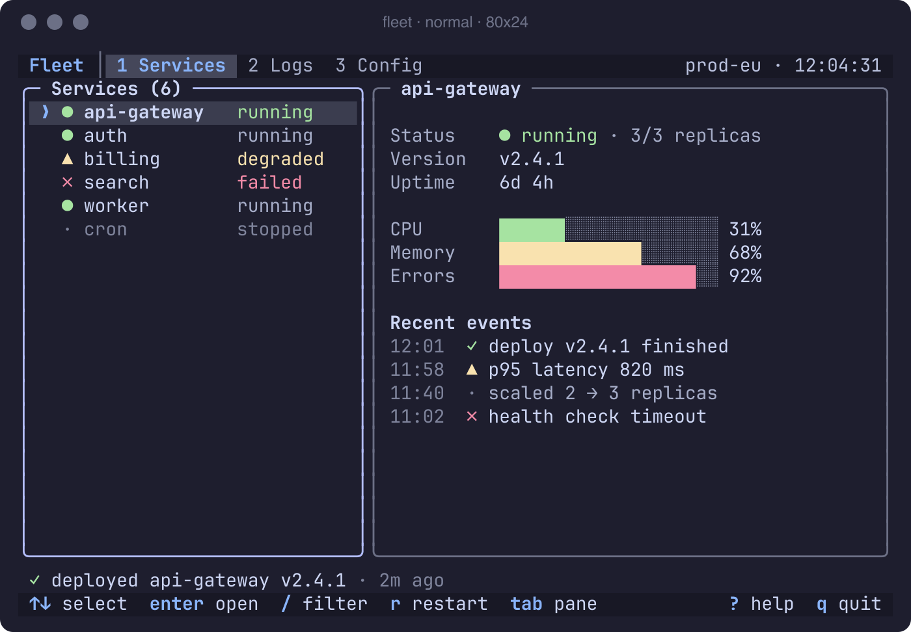

# Starters

Five proto-starters, one per framework, each rendering the same screen: the Fleet demo
([`assets/demo/fleet--normal--80x24.mock`](../../skills/tui-design/assets/demo/fleet--normal--80x24.mock)). A build
starts from a copy of one, so it begins with a theme loader, a too-small screen and a headless frame mode that the
design can be compared against.



*The mockup every starter reproduces. At 80×24 truecolor the Ink, Textual, Bubble Tea and Ratatui frames match it
cell for cell (characters, colors, bold), as their READMEs record. gum has no event loop, focus or layout engine, so
its starter draws a static approximation plus one interactive `gum choose` flow, and its README lists what gum
cannot do.*

| Starter | Folder | Pinned (verified 2026-10-01) | Frame command |
|---|---|---|---|
| Ink | [`ink/`](../../skills/tui-design/assets/proto-starters/ink/) | Node ≥ 22, ink 7.1.1, react 19.3.0, chalk 5.6.2 | `npx tsx src/cli.tsx --frame …` |
| Textual | [`textual/`](../../skills/tui-design/assets/proto-starters/textual/) | Python ≥ 3.11, textual 8.2.8 (exact) | `uv run python -m fleet --frame …` |
| Bubble Tea | [`bubbletea/`](../../skills/tui-design/assets/proto-starters/bubbletea/) | Go ≥ 1.26, bubbletea v2.0.10 | `go run . --frame …` |
| Ratatui | [`ratatui/`](../../skills/tui-design/assets/proto-starters/ratatui/) | Rust ≥ 1.88, ratatui 0.30.2 | `cargo run -q -- --frame …` |
| gum | [`gum/`](../../skills/tui-design/assets/proto-starters/gum/) | gum 2.0.1, jq 1.8.2 | `./fleet-static.sh …` |

Every starter installs its dependencies locally (npm, uv, Go modules, cargo); nothing goes global. Which framework
to pick for what (language, widgets, testing and frame capture, startup time) is in the skill's
[choosing.md](../../skills/tui-design/references/frameworks/choosing.md).

## Copy one into a project

```bash
export SKILL_DIR=/path/to/tui-design                 # the installed skill folder
cp -R "$SKILL_DIR/assets/proto-starters/textual" ./fleet-ui && cd ./fleet-ui
python3 "$SKILL_DIR/scripts/export_theme.py" catppuccin-mocha --target json -o theme.json
uv sync && uv run python -m fleet --theme theme.json  # interactive
```

`theme.json` is the flat theme from `export_theme.py --target json`; every starter reads only that file, so any of
the [25 themes](themes.md) (or your own) drops in. Each starter's README lists its key bindings, how tokens map
onto the framework's styles, and its known differences from the mockup.

## Frame mode

```bash
uv run python -m fleet --frame --cols 120 --rows 30 --theme theme.json --depth truecolor > fleet.ansi
```

`--frame --cols C --rows R --theme T --depth truecolor|256|16` prints exactly one frame of `R` lines at that size and
exits, with no terminal needed. That frame is what the gallery shows, what `compare.py` diffs against the mockup
and what the audit reads. Keep the frame mode in your copy; it is how the design is checked as the app grows.

## Capture and compare

```bash
./capture.sh catppuccin-mocha out/            # out/<framework>--normal--80x24.ansi and --120x30.ansi
DEPTH=16 ./capture.sh catppuccin-latte out/   # another theme and depth
python3 "$SKILL_DIR/scripts/compare.py" design/fleet--normal--80x24.mock out/textual--normal--80x24.ansi \
    --labels design,textual -o cmp.html
```

`capture.sh THEME_OR_JSON OUT_DIR` writes frames at 80×24 and 120×30 (the gum starter also captures its
interactive `gum choose` flow through a private tmux server). A theme id needs `SKILL_DIR` (or the starter still
inside the skill) to export it; a JSON path does not. For an app that is not a starter, capture the running app
with `capture_tui.sh` instead ([audit](audit.md#live-capture-the-app-runs)). Put the frames in a folder next to the
mockups and one [gallery](gallery.md) shows design and build together.

Differences that remain are framework facts, listed in each README: at 120×30 the Ink and Textual gauges widen with
the detail pane while Bubble Tea and Ratatui keep 40 cells; at 256 colors each framework uses its own quantizer.
